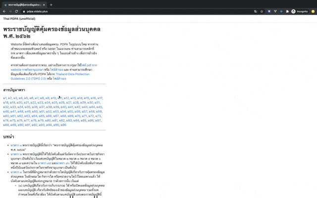

# Thai PDPA Website (Unofficial)



The content on this website is based on [the official document of Thailand's Personal Data Protection Act (PDPA) B.E. 2562](http://www.ratchakitcha.soc.go.th/DATA/PDF/2562/A/069/T_0052.PDF).

The website represents PDPA in a new format using [Gatsby-theme-andy](https://github.com/aravindballa/gatsby-theme-andy) (licensed under MIT).

The goal is to provide ease of access to PDPA and allow tracking of article references. Users can open referenced articles on the side portion of the desktop screen or landscape tablet (not on mobile or narrow screen).

## How-to

This website is built with [Gatsby-theme-andy](https://github.com/aravindballa/gatsby-theme-andy). To contribute, please consult its [documentation](https://github.com/aravindballa/gatsby-theme-andy).

### Requirements

- Node.js v12+
- Yarn

### Install

Clone this repository to your machine. At the repository's root directory, run

```{bash}
yarn install
```

### Development

Run

```{bash}
yarn dev
```

Then go to `localhost:8000` in your browser of choice. Any changes to the files saved will be automatically updated on the website.

### Build

Run

```{bash}
yarn build
```

The generated static site will be available at `public`

### Deployment

Once code pushed/merged into `master` branch on GitHub, the deploy action on SiData+'s Netlify will run automatically. (**If unsure, don't push to master but file a Pull Request first.**)

## Contributions

Contributions are highly welcome. Please submit your PRs.

## Roadmap

- Add simple Thai version of PDPA
- ...(more to come)...
